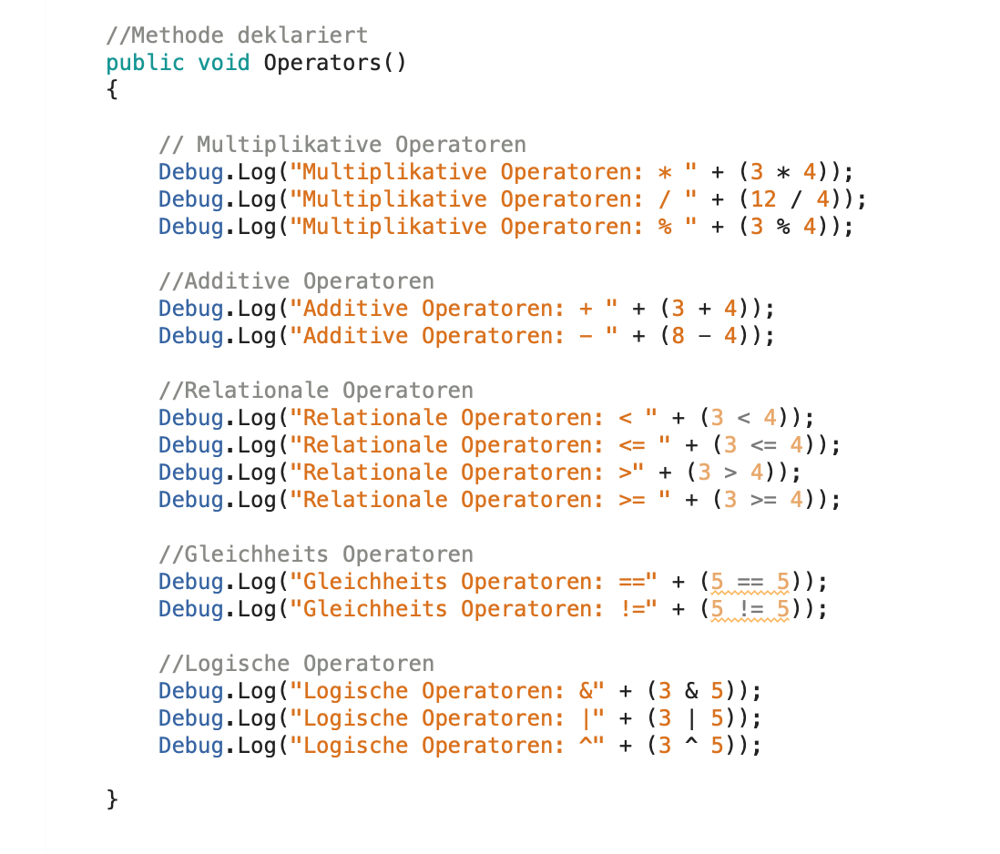

# ProgBasics-ahagenstein
**Progress:** 0%
 
### Development Platform:     
* OS: MacOS 10.14.3           
* Unity Version 2018.2.14f1    
* Visual Studio Version 7.7.2.21     

### Description       
* **Tests Operatoren:** verschieden Operatoren (Multiplikative, Additive, Relationale, Gleichheits und Logische) wurden in einem C# Script mit Debug.Log in die Unity Console geschieben und ausgeführt
* **Tests Methoden:** Übungen mit Variablen und Methoden wurden erstellt und in der Unity Console ausgeführt

### Screenshots      

* Unity

* Operatoren

* Console Unity

> Copyright by Anna Hagenstein
